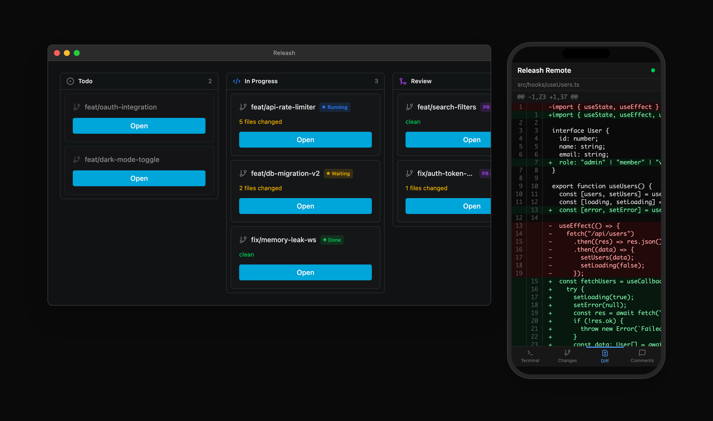
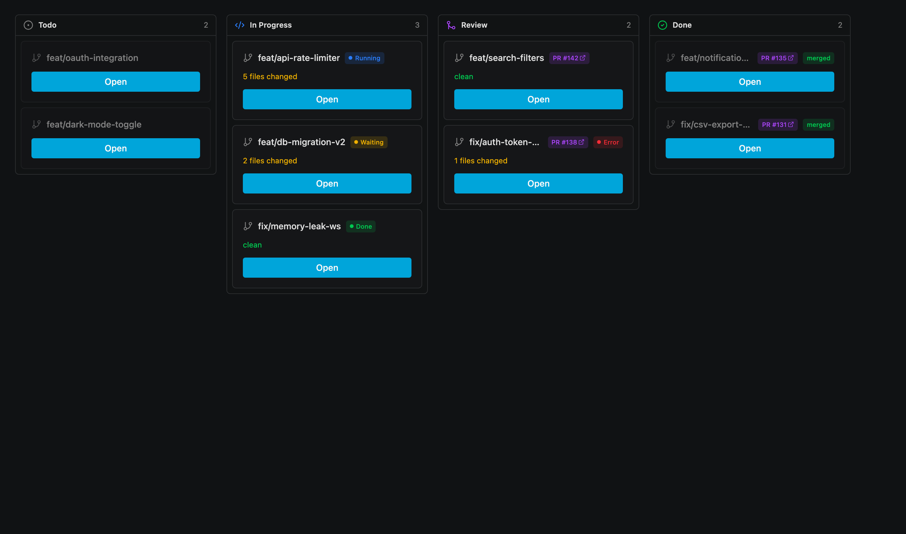
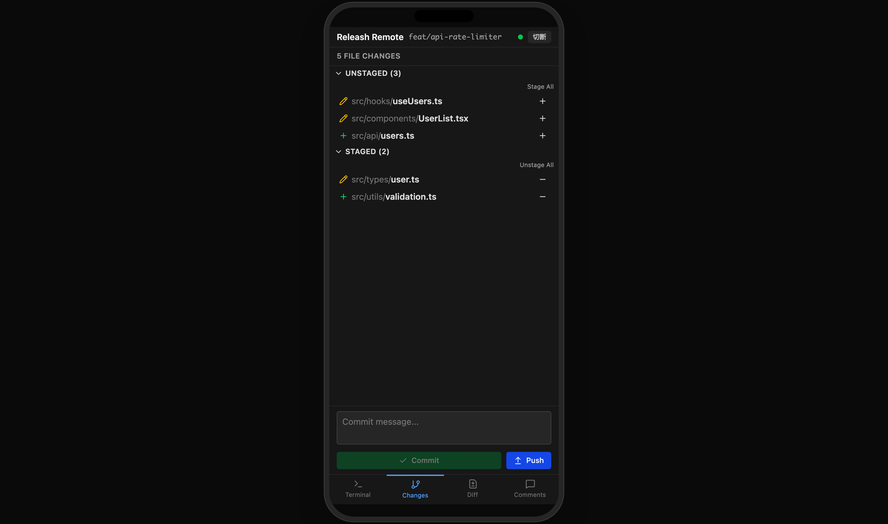
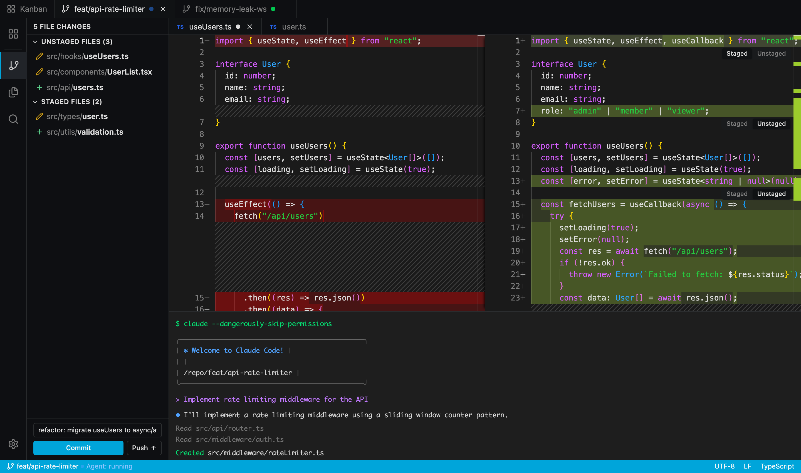

<!-- TODO: ロゴ画像 -->
<!-- <p align="center"></p> -->

# Releash

**Unleash your AI agent. Take the leash back from anywhere.**

<!-- TODO: ヒーローイメージ（デスクトップ + スマホ並び） -->
<!-- <p align="center"></p> -->

## Why Releash?

Running multiple CLI agents in parallel is easy — open a few terminals and go. The hard part is managing them. Which branch is still in progress? Which agent finished? Which one has a PR open? Which worktree is ready to merge?

Releash integrates worktrees, agents, and Git status into a single management layer. **A Kanban board shows all your parallel tasks — each backed by a worktree with its own terminal, editor, and source control. Manage them from your desktop, or from your phone.**

1. **Organize** tasks on the Kanban board — each card is a worktree with its own agent
2. **Track** agent status in real time — running, waiting, done
3. **Check in** from your phone — scan a QR code, see everything
4. **Review** diffs, leave comments, send feedback to agents
5. **Ship** — stage, commit, push, all without switching tools

No cloud, no IDE lock-in. Releash runs on your machine, watches Git, and works with any CLI agent that writes files.

## Features

### Kanban for parallel agents

Each worktree is a card on a Kanban board — Todo, In Progress, Review (PR open), Done (merged). See all your agents and their tasks at a glance. Click a card to jump into the worktree with the editor, terminal, and source control ready to go.

<!-- TODO: Kanbanボードのスクリーンショット -->
<!-- <p align="center"></p> -->

### Agent status tracking

Know whether your agent is running, waiting for input, or done. Get notified via Slack or Discord when it needs your attention. Connects through [Claude Code Hooks](https://docs.anthropic.com/en/docs/claude-code/hooks) for accurate state detection.

### Monitor and operate from your phone

Scan a QR code to open Releash in your phone's browser. Check agent status, browse diffs, stage files, operate the terminal, leave review comments — all without being at your desk.

Auto-detects VPN (Tailscale, WireGuard, ZeroTier) for secure remote access. No cloud relay — traffic stays on your network.

<!-- TODO: スマホでQRスキャン → リモートUI のスクリーンショット -->
<!-- <p align="center"></p> -->

### Precision diff review

Three view modes — gutter (compact), inline, and split (side-by-side). Stage exactly the lines you want with hunk-level and group-level staging. Leave inline comments on any line and send them to the agent in one click.

<!-- TODO: diff表示（Split or Gutter）のスクリーンショット -->
<!-- <p align="center"></p> -->

### Full Git workflow

Stage, unstage, commit, and push without leaving the app. Partial staging at the hunk level. Branch management with worktree support.

### Built-in terminal

A real PTY terminal, not a toy. Shell integration detects when commands finish. Review comments are sent directly as text input, so it works with any agent — no plugins or integrations required.

## Getting Started

### Download

<!-- TODO: GitHub Releases リンク -->
<!-- Download the latest release from [GitHub Releases](https://github.com/siro33950/releash/releases). -->

### Build from source

Prerequisites: [Node.js](https://nodejs.org/) (v18+), [pnpm](https://pnpm.io/), [Rust](https://www.rust-lang.org/tools/install), [Tauri v2 prerequisites](https://v2.tauri.app/start/prerequisites/)

```sh
pnpm install
pnpm tauri dev
```

## How It Works

```
Create worktrees for each task
        ↓
Launch agents in their terminals
        ↓
Agents edit files — Releash watches Git for changes
        ↓
Kanban board tracks status: Todo → In Progress → Review → Done
        ↓
Check in from desktop or phone — review diffs, leave comments
        ↓
Comments go straight to the agent as terminal input
        ↓
Stage, commit, push — done
```

Releash doesn't parse agent output or depend on any specific agent's API. It watches the filesystem and reads Git. That's why it works with Claude Code, Aider, Cline, or any tool that writes files.

## Tech Stack

| Layer | Technology |
|-------|-----------|
| Desktop | [Tauri 2](https://v2.tauri.app/) (Rust) |
| Frontend | React 19, Monaco Editor, xterm.js |
| Git | git2 crate |
| Remote | WebSocket server + PWA, QR code auth |
| Terminal | portable-pty |

## License

MIT OR Apache-2.0
